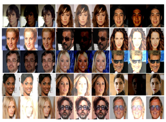
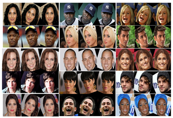
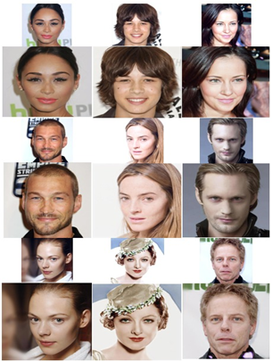
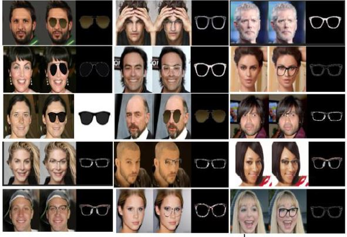

# Preprocessing Correction

The project directory is under `MainProject`.

## Running the script

In the project directory, we can find a `.json` file named `config.json`, which is loaded first while running the script.

The main parameters are the ones under `run-settings`, there we can enable/disable each feature of our preprocessing.

When a feature is enabled, by using the parameter `train-###`, we can control whether we want to train the model or load a pre-trained one.

When a feature is enabled, the model parameters can be found under the corresponding `json` paramaters. eg. rotation model parameters can be found under `rotation`.\
The parameters are self-explanatory, or can be found in the PDF.\
The parameter `pre-trained-path` determines the path to the model weights from previous training, and is taken if `train-###` is set to `false`.

At the end of the run, we evaluate the model using the dataset found under `["run-setting"]["eval-dataset-path"]`\
The model run the images through all the enabled features.

## The Models

Pre-trained model weights are available in the server university, the config.json contains the path to the corresponding model weights.\
In addition, the weights are available in Google-Drive: https://drive.google.com/drive/folders/13HODDXB4Xa26N6GbHBKFspO8lvAScicY?usp=sharing

The default run disable the glasses model.\r after training.

The pre-trained model is not ideal, this is due to a change in image-size while concatenating the models together.\
We changed the image size to 256, instead of 144, due to super-sampling input size.\
The training on image size 256 didn't converge, so we couldn't provide pre-trained weights.\
The glasses model is available for training, and the network parameters can be changed in `config.json` file.

## Results
<table style="text-align:center" border="0">
<tr>
<td>Color-Corretion results</td>
<td>Rotation-correction results</td>
</tr>
<tr>
<td>

</td>
<td>

</td>
</tr>
<tr>
<td>Super-resolution results</td>
<td>Glasses results</td>
</tr>
<tr>
<td>

</td>
<td>

</td>
</tr>
</table>
